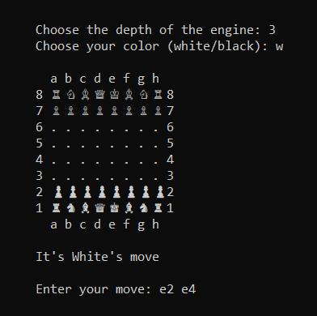

# Chess Engine
A robust chess engine implementation built using Minimax and Alpha-Beta Pruning algorithms. This engine evaluates positions heuristically and supports standard chess gameplay features.

## Features
* Implements Minimax with Alpha-Beta Pruning for optimal decision-making.
* Supports essential chess rules:
    * Castling (Kingside and Queenside).
    * En Passant.
    * Pawn promotion.
    * Threefold repetition
    * Fifty-move rule
* Implements a FEN string input option so that you can input your games.
* Utilizes a Polyglot opening book for quick and accurate early-game decisions.
* Includes a command-line interface(CLI) for playing against the engine.

## Requirements
* Python 3.8 or higher.

## Installation
Clone this repository:

```
git clone https://github.com/Thanos-png/chess-engine.git
cd chess-engine
```

## Run
To start a game run the following command on your CLI:

```python3 main.py```

## How to Play
Once the game starts, follow the prompts and choose a depth at which you would like the engine to play.  
You can choose any values from ```1``` to ```5``` or just press ```enter``` and it will be adjusted automatically.  
To choose the color you want to play as you can type ```w``` as well as ```white``` and ```b``` as well as ```black```  
Or if you want the engine to play with itself you can press ```Enter```  
After you chose the depth and your color you can input your moves.  
(e.g., ```e2 e4``` for moving a pawn from ```e2``` to ```e4```).

### Example Gameplay



**Note:** You can type ```fen``` as a move if you want to input a specific position using a fen string. Or you can type either ```r``` or ```resign``` if you wish to surrender.

## Contributing
Contributions are welcome! Please feel free to fork the repository and submit a pull request.

### Todo
1. Add a Transposition Table
2. Add an Endgame Table
3. Bitmap Implementation

## Contact
For questions or feedback, feel free to reach me out:
* **Email:** thanos.panagiotidis@protonmail.com
